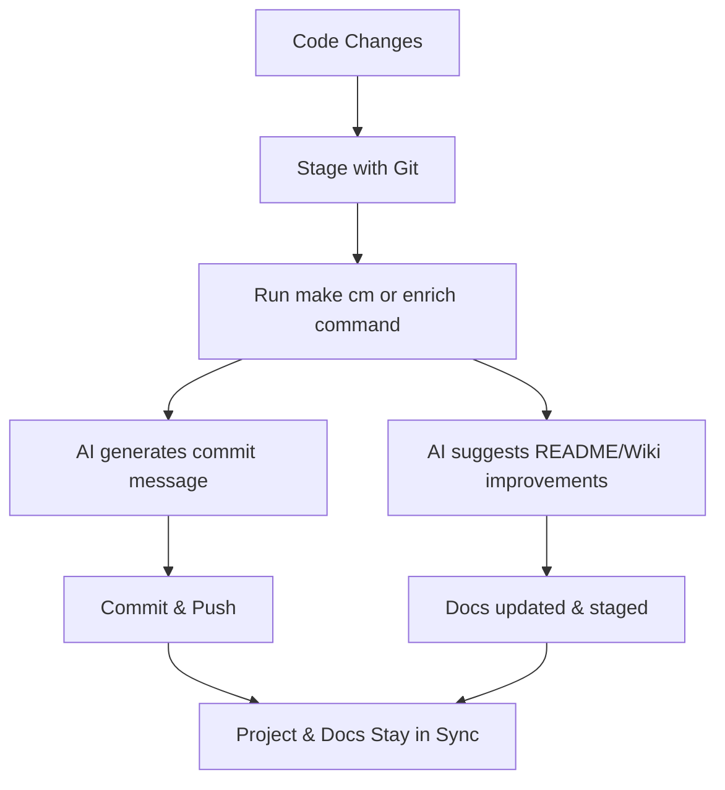

# Welcome to **ai_commit_and_readme** 🚀

**ai_commit_and_readme** is your all-in-one toolkit for automating commit message generation and enriching your README and Wiki documentation using AI. Designed for seamless integration into any development workflow, it helps you keep your project documentation and commit history clear, up-to-date, and high quality—with minimal effort.

---

## ✨ What Does It Do?

- **AI-Powered Commit Messages:** Instantly generate meaningful, context-aware commit messages based on your code changes.
- **Automated README & Wiki Enrichment:** Let AI suggest and append improvements to your README and Wiki articles, keeping docs fresh and relevant.
- **Effortless Integration:** Works with your existing Makefile and git workflow—no need to change your habits.
- **Robust Testing & Linting:** Includes helpers for code quality, formatting, and comprehensive test coverage.
- **Smart Diff Analysis:** Only documents what's changed, making updates precise and concise.

---

## 🛠️ Key Features

- **One-Command Enrichment:** Update your README and Wiki with a single command.
- **Customizable Prompts:** Fine-tune how AI suggests documentation improvements.
- **Fallbacks & Error Handling:** Gracefully handles missing API keys, empty diffs, or absent files.
- **Extensible:** Easily add new documentation targets or AI enrichment strategies.
- **Modern Python:** Built with best practices, type hints, and a clean, maintainable codebase.

---

## 🚦 Typical Workflow



---

## 📦 Quick Start

1. Clone the repository and install dependencies:
   ```sh
   git clone https://github.com/auraz/ai_commit_and_readme.git
   cd ai_commit_and_readme
   make install
   ```
2. Configure your environment ([see full guide in the Wiki](https://github.com/auraz/ai_commit_and_readme/wiki/Configuration))
3. Use Makefile commands ([see all commands in the Wiki](https://github.com/auraz/ai_commit_and_readme/wiki/Usage))

---

## 📚 Documentation

Full documentation is available in the [GitHub Wiki](https://github.com/auraz/ai_commit_and_readme/wiki):

- [Installation](https://github.com/auraz/ai_commit_and_readme/wiki/Installation)
- [Usage](https://github.com/auraz/ai_commit_and_readme/wiki/Usage)
- [Configuration](https://github.com/auraz/ai_commit_and_readme/wiki/Configuration)
- [FAQ](https://github.com/auraz/ai_commit_and_readme/wiki/FAQ)
- [Contributing](https://github.com/auraz/ai_commit_and_readme/wiki/Contributing)
- [Changelog](https://github.com/auraz/ai_commit_and_readme/wiki/Changelog)
- [API Reference](https://github.com/auraz/ai_commit_and_readme/wiki/API)

---

## Installation

See [Installation instructions in the Wiki](https://github.com/auraz/ai_commit_and_readme/wiki/Installation)

## Creating a Virtual Environment

See [Virtual Environment setup in the Wiki](https://github.com/auraz/ai_commit_and_readme/wiki/Installation#virtual-environment)

## Linting & Formatting

See [Linting and Formatting in the Wiki](https://github.com/auraz/ai_commit_and_readme/wiki/Usage#linting--formatting)

## Testing & Coverage

See [Testing and Coverage in the Wiki](https://github.com/auraz/ai_commit_and_readme/wiki/Testing)

## Cleaning

See [Cleaning instructions in the Wiki](https://github.com/auraz/ai_commit_and_readme/wiki/Usage#cleaning)

## AI Commit and Push

See [AI Commit and Push in the Wiki](https://github.com/auraz/ai_commit_and_readme/wiki/Usage#ai-commit-and-push)

## Error Handling

See [Error Handling in the Wiki](https://github.com/auraz/ai_commit_and_readme/wiki/FAQ#error-handling)

## Feedback & Enrichment

See [Feedback & Enrichment in the Wiki](https://github.com/auraz/ai_commit_and_readme/wiki/Usage#feedback--enrichment)

## New Features

See [New Features in the Wiki](https://github.com/auraz/ai_commit_and_readme/wiki/Changelog)
## Logging

The code now includes logging functionality using Python's `logging` module instead of direct `print` statements. The logging is configured at the INFO level, providing consistent logging of information and warnings across the application. This change enhances the reporting of the application state and errors, especially useful for tracking the behavior during execution and debugging. 

### Key Logger Levels Used:
- `logging.info`: Used for informational messages that highlight the progress of the application at a coarse-grained level.
- `logging.warning`: Used for warnings about potentially harmful situations.
- `logging.error`: Used for error messages when exceptions occur in the application.

Ensure to monitor the log output when running the application to gather insights into its operation and to troubleshoot any issues that may arise.

## Makefile Commands

### Updated Commands
- **superusage**: Replaces the previous `usage` command. This command provides help information for the `ai_commit_and_readme` module. Usage remains the same:

  ```sh
  make superusage
  ```


## Usage

The Makefile has been updated with a new command named `new_command`. Here is the additional usage information:

- **new_command**: This command executes the `ai_commit_and_readme.main` module using Python 3 with the help flag. It also includes placeholder or debug lines like `lol!` and `sdsdsdds`.

To run this command, use:

```bash
make new_command
```


## 🛠️ Makefile Commands Overview

```plaintext
# List of key commands added or modified in the Makefile

# Build the project:
make build

# Run all unit tests:
make test

# Clean up the build:
make clean

# Install dependencies:
make deps

# Generate project documentation:
make docs

# Please refer to the Makefile for the complete list of commands and their descriptions.
```
