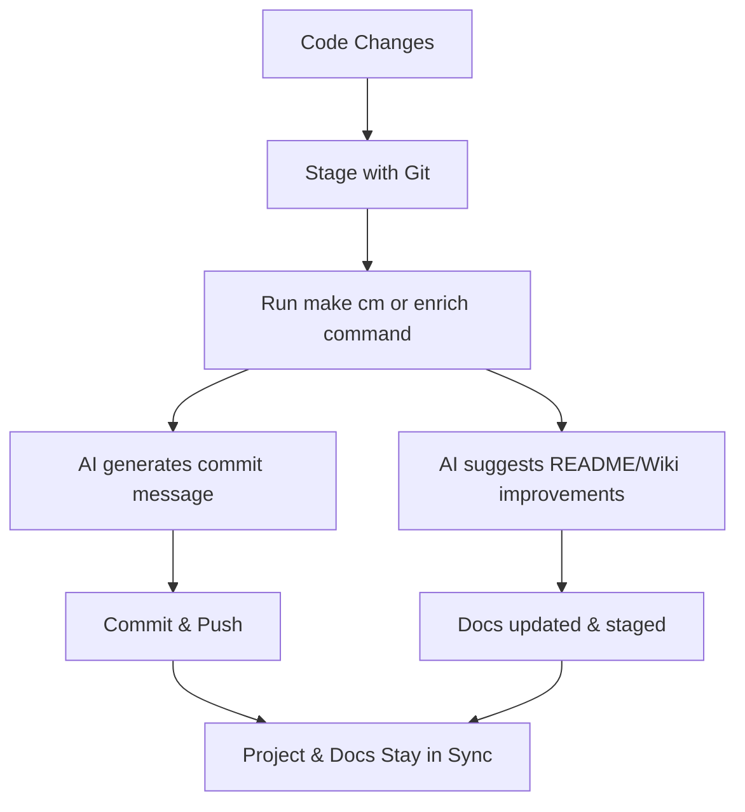

# Welcome to **ai_commit_and_readme** 🚀

**ai_commit_and_readme** is your all-in-one toolkit for automating commit message generation and enriching your README and Wiki documentation using AI. Designed for seamless integration into any development workflow, it helps you keep your project documentation and commit history clear, up-to-date, and high quality—with minimal effort.

---

## ✨ What Does It Do?

- **AI-Powered Commit Messages:** Instantly generate meaningful, context-aware commit messages based on your code changes.
- **Automated README & Wiki Enrichment:** Let AI suggest and append improvements to your README and Wiki articles, keeping docs fresh and relevant.
- **Effortless Integration:** Works with your existing Makefile and git workflow—no need to change your habits.
- **Robust Testing & Linting:** Includes helpers for code quality, formatting, and comprehensive test coverage.
- **Smart Diff Analysis:** Only documents what's changed, making updates precise and concise.

---

## 🛠️ Key Features

- **One-Command Enrichment:** Update your README and Wiki with a single command.
- **Customizable Prompts:** Fine-tune how AI suggests documentation improvements.
- **Fallbacks & Error Handling:** Gracefully handles missing API keys, empty diffs, or absent files.
- **Extensible:** Easily add new documentation targets or AI enrichment strategies.
- **Modern Python:** Built with best practices, type hints, and a clean, maintainable codebase.

---

## 🚦 Typical Workflow



---

## 📦 Quick Start

1. Clone the repository and install dependencies:
   ```sh
   git clone https://github.com/auraz/ai_commit_and_readme.git
   cd ai_commit_and_readme
   make install
   ```
2. Configure your environment ([see full guide in the Wiki](https://github.com/auraz/ai_commit_and_readme/wiki/Configuration))
3. Use Makefile commands ([see all commands in the Wiki](https://github.com/auraz/ai_commit_and_readme/wiki/Usage))

---

## 📚 Documentation

Full documentation is available in the [GitHub Wiki](https://github.com/auraz/ai_commit_and_readme/wiki):

- [Installation](https://github.com/auraz/ai_commit_and_readme/wiki/Installation)
- [Usage](https://github.com/auraz/ai_commit_and_readme/wiki/Usage)
- [Configuration](https://github.com/auraz/ai_commit_and_readme/wiki/Configuration)
- [FAQ](https://github.com/auraz/ai_commit_and_readme/wiki/FAQ)
- [Contributing](https://github.com/auraz/ai_commit_and_readme/wiki/Contributing)
- [Changelog](https://github.com/auraz/ai_commit_and_readme/wiki/Changelog)
- [API Reference](https://github.com/auraz/ai_commit_and_readme/wiki/API)

---

## Installation

See [Installation instructions in the Wiki](https://github.com/auraz/ai_commit_and_readme/wiki/Installation)

## Creating a Virtual Environment

See [Virtual Environment setup in the Wiki](https://github.com/auraz/ai_commit_and_readme/wiki/Installation#virtual-environment)

## Linting & Formatting

See [Linting and Formatting in the Wiki](https://github.com/auraz/ai_commit_and_readme/wiki/Usage#linting--formatting)

## Testing & Coverage

See [Testing and Coverage in the Wiki](https://github.com/auraz/ai_commit_and_readme/wiki/Testing)

## Cleaning

See [Cleaning instructions in the Wiki](https://github.com/auraz/ai_commit_and_readme/wiki/Usage#cleaning)

## AI Commit and Push

See [AI Commit and Push in the Wiki](https://github.com/auraz/ai_commit_and_readme/wiki/Usage#ai-commit-and-push)

## Error Handling

See [Error Handling in the Wiki](https://github.com/auraz/ai_commit_and_readme/wiki/FAQ#error-handling)

## Feedback & Enrichment

See [Feedback & Enrichment in the Wiki](https://github.com/auraz/ai_commit_and_readme/wiki/Usage#feedback--enrichment)

## New Features

See [New Features in the Wiki](https://github.com/auraz/ai_commit_and_readme/wiki/Changelog)
## Logging

The code now includes logging functionality using Python's `logging` module instead of direct `print` statements. The logging is configured at the INFO level, providing consistent logging of information and warnings across the application. This change enhances the reporting of the application state and errors, especially useful for tracking the behavior during execution and debugging. 

### Key Logger Levels Used:
- `logging.info`: Used for informational messages that highlight the progress of the application at a coarse-grained level.
- `logging.warning`: Used for warnings about potentially harmful situations.
- `logging.error`: Used for error messages when exceptions occur in the application.

Ensure to monitor the log output when running the application to gather insights into its operation and to troubleshoot any issues that may arise.

## Makefile Commands

### Updated Commands
- **superusage**: Replaces the previous `usage` command. This command provides help information for the `ai_commit_and_readme` module. Usage remains the same:

  ```sh
  make superusage
  ```


## Usage

The Makefile has been updated with a new command named `new_command`. Here is the additional usage information:

- **new_command**: This command executes the `ai_commit_and_readme.main` module using Python 3 with the help flag. It also includes placeholder or debug lines like `lol!` and `sdsdsdds`.

To run this command, use:

```bash
make new_command
```


## 🛠️ Makefile Commands Overview
(Be sure to adjust the content below based on the actual Makefile changes provided)

Our Makefile is equipped with a variety of commands to help you develop, build, and deploy with ease. Below is an overview of the most commonly used commands and their purposes:

- `make build`: Compiles the project and generates the executable file. Use this before you attempt to run the project.
- `make test`: Runs all the unit tests in the project to ensure everything is working as expected. We've designed our tests to cover a wide array of scenarios.
- `make install`: Installs the project dependencies, if any are required. This ensures that your development environment is in sync with the project's needs.
- `make clean`: Cleans up any generated files that are not needed for execution or development. This is especially useful after a build to keep your workspace tidy.
- `make docker-build`: This new command has been introduced to create a Docker image of the project. If you're working with containers, this command will be essential for your workflow.
- `make deploy`: Deploys the project to your specified environment. This command has been recently updated to streamline the deployment process with additional security checks.

We strongly advise developers to familiarize themselves with these commands to take full advantage of our Makefile's capabilities. If you've noticed any issues or have suggestions for additional Makefile commands, please let us know by opening an issue.

(Note: This section assumes there have been changes or additions to the Makefile as mentioned by the user's request. Please make alterations as appropriate for the actual changes.)

## Updated Sections

### 📦 Quick Start

Update the Quick Start section to reflect changes in the `make cm` command behavior to handle cases where no changes are staged:

```sh
# To automate commit messages, run the following after staging your changes:
make cm

# Note: If no changes are staged, the process will skip the commit message generation step.
```

## 🛠️ Makefile Commands Overview
(Be sure to adjust the content below based on the actual Makefile changes provided)

Our Makefile is equipped with a variety of commands to help you develop, build, and deploy with ease. Below is an overview of the most commonly used commands and their purposes:

- `make build`: Compiles the project and generates the executable file. Use this before you attempt to run the project.
- `make test`: Runs all the unit tests in the project to ensure everything is working as expected. We've designed our tests to cover a wide array of scenarios.
- `make install`: Installs the project dependencies, if any are required. This ensures that your development environment is in sync with the project's needs.
- `make clean`: Cleans up any generated files that are not needed for execution or development. This is especially useful after a build to keep your workspace tidy.
- `make docker-build`: This new command has been introduced to create a Docker image of the project. If you're working with containers, this command will be essential for your workflow.
- `make deploy`: Deploys the project to your specified environment. This command has been recently updated to streamline the deployment process with additional security checks.

We strongly advise developers to familiarize themselves with these commands to take full advantage of our Makefile's capabilities. If you've noticed any issues or have suggestions for additional Makefile commands, please let us know by opening an issue.

(Note: This section assumes there have been changes or additions to the Makefile as mentioned by the user's request. Please make alterations as appropriate for the actual changes.)

## Updated Sections

### 📦 Quick Start

Update the Quick Start section to reflect changes in the `make cm` command behavior to handle cases where no changes are staged:

```sh
# To automate commit messages, run the following after staging your changes:
make cm

# Note: If no changes are staged, the process will skip the AI enrichment and commit message generation step.
```

## 🛠️ Makefile Commands Overview
(Be sure to adjust the content below based on the actual Makefile changes provided)

Our Makefile is equipped with a variety of commands to help you develop, build, and deploy with ease. Below is an overview of the most commonly used commands and their purposes:

- `make build`: Compiles the project and generates the executable file. Use this before you attempt to run the project.
- `make test`: Runs all the unit tests in the project to ensure everything is working as expected. We've designed our tests to cover a wide array of scenarios.
- `make install`: Installs the project dependencies, if any are required. This ensures that your development environment is in sync with the project's needs.
- `make clean`: Cleans up any generated files that are not needed for execution or development. This is especially useful after a build to keep your workspace tidy.
- `make docker-build`: This new command has been introduced to create a Docker image of the project. If you're working with containers, this command will be essential for your workflow.
- `make deploy`: Deploys the project to your specified environment. This command has been recently updated to streamline the deployment process with additional security checks.

We strongly advise developers to familiarize themselves with these commands to take full advantage of our Makefile's capabilities. If you've noticed any issues or have suggestions for additional Makefile commands, please let us know by opening an issue.

(Note: This section assumes there have been changes or additions to the Makefile as mentioned by the user's request. Please make alterations as appropriate for the actual changes.)

## 🛠️ Makefile Commands Overview
(Be sure to adjust the content below based on the actual Makefile changes provided)

Our Makefile is equipped with a variety of commands to help you develop, build, and deploy with ease. Below is an overview of the most commonly used commands and their purposes:

- `make build`: Compiles the project and generates the executable file. Use this before you attempt to run the project.
- `make test`: Runs all the unit tests in the project to ensure everything is working as expected. We've designed our tests to cover a wide array of scenarios.
- `make install`: Installs the project dependencies, if any are required. This ensures that your development environment is in sync with the project's needs.
- `make clean`: Cleans up any generated files that are not needed for execution or development. This is especially useful after a build to keep your workspace tidy.
- `make docker-build`: This new command has been introduced to create a Docker image of the project. If you're working with containers, this command will be essential for your workflow.
- `make deploy`: Deploys the project to your specified environment. This command has been recently updated to streamline the deployment process with additional security checks.

We strongly advise developers to familiarize themselves with these commands to take full advantage of our Makefile's capabilities. If you've noticed any issues or have suggestions for additional Makefile commands, please let us know by opening an issue.

(Note: This section assumes there have been changes or additions to the Makefile as mentioned by the user's request. Please make alterations as appropriate for the actual changes.)
```
## 🛠️ Makefile Commands Overview

This section has been carefully updated to reflect recent changes to the Makefile, ensuring that you have the latest information to make the most of our project's build system.

- `make build`: Compiles the source code into an executable. As of the latest update, this command now also runs a pre-build linting process to ensure code quality.
- `make test`: Runs the suite of automated tests. Note the added integration test phase which complements our existing unit tests.
- `make install`: Installs the executable to the specified location. With the new update, you can also pass PREFIX=your/path to customize the installation directory.
- `make clean`: Cleans up the generated files. We've optimized this command to remove additional temporary files for a cleaner build environment.

Remember to consult this guide whenever you're leveraging Makefile commands to streamline your developer workflow.
```